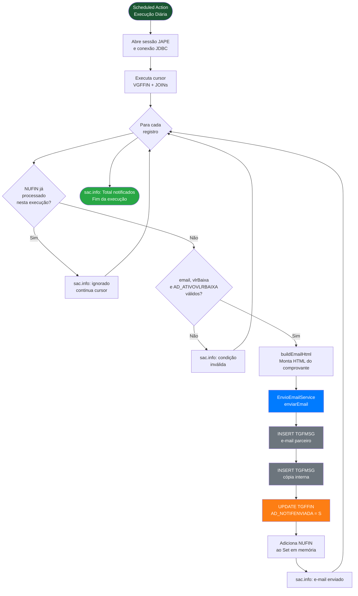

<div align="center">
  
</div>

# 🧾 AG-AVISO-DATA-BAIXA — Comprovante Automático de Pagamento para Parceiros

> Rotina agendada (Scheduled Action) no Sankhya ERP que envia automaticamente comprovantes de pagamento por e-mail aos parceiros no dia seguinte à baixa de seus títulos financeiros. Considera apenas baixas de pagamento a fornecedor (título de despesa, baixado pela TOP 1500), filtra parceiros habilitados para notificação, garante envio único por título via flag de controle na TGFFIN e emite cópia interna para o setor financeiro a cada disparo.

---


---

## 📖 Sobre o Projeto

No dia a dia financeiro da Argo Fruta, quando um título é baixado no sistema, o parceiro (fornecedor, transportadora, prestador) muitas vezes não tem como saber que o pagamento foi realizado — a menos que entre em contato diretamente com o financeiro ou aguarde o extrato bancário.

Este projeto resolve esse gargalo com uma **Scheduled Action em Java** que roda diariamente e:

- Consulta os títulos de despesa (`RECDESP = -1`) baixados **no dia anterior** (`SYSDATE - 1`) pela TOP de baixa **1500** via `VGFFIN` — exclui compensações (TOPs 1501 / 1407) e devoluções
- Filtra apenas os parceiros que possuem o flag `AD_ATIVOVLRBAIXA = 'S'` (habilitados para receber notificação)
- Garante que cada título (`NUFIN`) gera no máximo **um e-mail**, marcando `AD_NOTIFENVIADA = 'S'` na `TGFFIN` após o envio
- Envia um **comprovante HTML** ao e-mail do parceiro com os dados do pagamento (número da nota, data, valor, parceiro) e, quando preenchido, o número da **Invoice CMA**
- Envia uma **cópia automática** para `comprovante.pagamento@argofruta.com`, mantendo o financeiro informado
- Controla envios duplicados dentro da mesma execução via `Set<BigDecimal>` em memória, garantindo idempotência

---

## 📁 Estrutura do Projeto

```
AG_AVISO_DATA_BAIXA/
├── src/
│   └── br/com/principal/aviso/dtbaixa/
│       ├── controller/
│       │   └── DtbaixaPrincipal.java      # Classe principal — implementa ScheduledAction
│       └── service/
│           ├── EnvioEmailService.java      # Envia e-mail via fila TGFMSG do Sankhya
│           └── NotificacaoService.java     # Envia avisos internos via AvisoSistema
├── docs/
│   └── changelog.md                       # Histórico detalhado de alterações
└── README.md
```

---

## 📚 Referência — Classes Principais

### `DtbaixaPrincipal`

| Aspecto | Detalhe |
|---|---|
| **Tipo** | Scheduled Action (`org.cuckoo.core.ScheduledAction`) |
| **Execução** | Configurada no Agendador de Tarefas do Sankhya |
| **Entrypoint** | `onTime(ScheduledActionContext sac)` |
| **Fonte de dados** | `VGFFIN` (view financeira) + `TGFPAR`, `TSIEMP`, etc. |
| **Controle de reenvio** | Flag `AD_NOTIFENVIADA` na `TGFFIN` + `Set<BigDecimal>` em memória |

**Filtros aplicados na consulta SQL:**

| Condição | Descrição |
|---|---|
| `RECDESP = -1` | Apenas títulos de despesa (pagamentos a fornecedores) |
| `TRUNC(DHBAIXA) = TRUNC(SYSDATE) - 1` | Baixados no dia anterior — o disparo ocorre em D+1 |
| `CODTIPOPERBAIXA = 1500` | Apenas baixas de pagamento normal via banco — exclui compensação (TOPs 1501 / 1407) e devolução |
| `PROVISAO IN ('N', 'S')` e sem baixa provisionada | Exclui provisões com baixa fictícia |
| `AD_ATIVOVLRBAIXA = 'S'` | Parceiro habilitado para receber comprovante |
| `AD_EMAILCLIENT IS NOT NULL OR EMAIL IS NOT NULL` | Parceiro com pelo menos um e-mail cadastrado (múltiplo ou padrão) |
| `VLRBAIXA > 0` | Valor positivo (descarta estornos) |
| `AD_NOTIFENVIADA = 'N'` | Título ainda não notificado |

---

### `EnvioEmailService`

| Aspecto | Detalhe |
|---|---|
| **Método** | `enviarEmail(titulo, mensagem, emailsParceiro)` |
| **Destinatário** | Lista de e-mails do parceiro (`TGFPAR.AD_EMAILCLIENT`, com fallback para `TGFPAR.EMAIL`) — um registro na fila por endereço |
| **Cópia fixa** | `comprovante.pagamento@argofruta.com` |
| **Fila utilizada** | `TGFMSG` (entidade `DynamicEntityNames.FILA_MSG`) |
| **Tentativas** | Até 3 (`MAXTENTENVIO = 3`) |
| **Formato** | HTML com identidade visual Argo Fruta |

---

### `NotificacaoService`

| Aspecto | Detalhe |
|---|---|
| **Método principal** | `notificarUsuarios(coduser, obs, titulo)` |
| **Método individual** | `notifUsu(codUsu, obs, titulo)` |
| **Método broadcast** | `notifUsuUnico(obs, titulo)` |
| **Canal** | Aviso interno do Sankhya (`AvisoSistema`) |
| **Importância** | Nível 2 (individual) / Nível 3 (broadcast) |

---

## 🗄 Objetos de Banco de Dados

### Tabelas Envolvidas

| Tabela | Alias | Operação | Descrição |
|---|---|---|---|
| `VGFFIN` | VGFFIN | READ | View financeira — fonte principal com dados de baixa |
| `TGFFIN` | FIN | READ / UPDATE | Títulos financeiros — leitura e marcação `AD_NOTIFENVIADA` |
| `TGFVEN` | VEN | READ | Vendedores / representantes |
| `TGFPAR` | PAR | READ | Parceiros — razão social, e-mail, flag `AD_ATIVOVLRBAIXA` |
| `TSIEMP` | EMP | READ | Empresas — nome fantasia da empresa pagadora |
| `TGFNAT` | NAT | READ | Natureza de operação |
| `TGFTIT` | TIT | READ | Tipos de títulos |
| `TSICUS` | CUS | READ | Centros de custo |
| `TSIBCO` | BCO | READ | Bancos |
| `TGFTOP` | TPP | READ | Tipos de operação |
| `TCSPRJ` | PROJ | READ | Projetos |
| `TSICTA` | CTA | READ | Contas bancárias (LEFT JOIN) |
| `TSIMOE` | Moeda | READ | Moedas (LEFT JOIN) |
| `TGFCAB` | CAB | READ | Cabeçalho das notas (LEFT JOIN por `NUNOTA`) — número da nota (`NUMNOTA`) e `AD_INVOICECMA` |
| `TGFMSG` | — | INSERT | Fila de envio de e-mails do Sankhya |

### Campos Customizados Utilizados

| Campo | Tabela | Tipo | Descrição |
|---|---|---|---|
| `AD_ATIVOVLRBAIXA` | `TGFPAR` | CHAR(1) | Flag de habilitação para envio de comprovante. Valores: `'S'` / `'N'` |
| `AD_NOTIFENVIADA` | `TGFFIN` | CHAR(1) | Flag de controle de envio. Setado para `'S'` após o envio bem-sucedido |
| `AD_EMAILCLIENT` | `TGFPAR` | VARCHAR | E-mails **adicionais** do parceiro, separados por vírgula (`,`) ou ponto-e-vírgula (`;`). Somados ao `EMAIL` padrão (nunca o substitui) — use quando o parceiro precisar receber o comprovante em mais de um endereço |
| `AD_INVOICECMA` | `TGFCAB` | VARCHAR | Número da fatura (invoice) da **CMA / F-Trade**, informado no cabeçalho da nota. Campo **não obrigatório** — quando preenchido, aparece como um bloco extra no comprovante; quando vazio, o e-mail sai idêntico ao dos demais fornecedores |

---

## 🚀 Guia de Implantação (Deploy)

### 1. Criar o Campo AD_ATIVOVLRBAIXA na TGFPAR

Acessar **Dicionário de Dados** no Sankhya e adicionar:

| Campo | Tabela | Tipo | Tamanho | Descrição |
|---|---|---|---|---|
| `AD_ATIVOVLRBAIXA` | `TGFPAR` | CHAR | 1 | Flag de notificação — `'S'` habilita envio de comprovante |

### 2. Criar o Campo AD_NOTIFENVIADA na TGFFIN

Acessar **Dicionário de Dados** no Sankhya e adicionar:

| Campo | Tabela | Tipo | Tamanho | Descrição |
|---|---|---|---|---|
| `AD_NOTIFENVIADA` | `TGFFIN` | CHAR | 1 | Controle de envio — `'S'` indica que o comprovante já foi enviado |

### 3. Criar os Campos Opcionais (múltiplos e-mails e Invoice CMA)

Acessar **Dicionário de Dados** no Sankhya e adicionar:

| Campo | Tabela | Tipo | Tamanho | Descrição |
|---|---|---|---|---|
| `AD_EMAILCLIENT` | `TGFPAR` | VARCHAR | 500 (sugerido) | Lista de e-mails adicionais separados por `,` ou `;`. Somados ao `EMAIL` padrão do parceiro (não o substitui) |
| `AD_INVOICECMA` | `TGFCAB` | VARCHAR | 60 (sugerido) | Número da fatura (invoice) da CMA / F-Trade, informado no cabeçalho da nota. **Não obrigatório** — incluir no layout de pedidos/notas apenas para os usuários da logística |

```sql
-- Exemplo: cadastrar múltiplos e-mails para um parceiro
UPDATE TGFPAR SET AD_EMAILCLIENT = 'financeiro@parceiro.com; contabilidade@parceiro.com' WHERE CODPARC = <codigo>;
COMMIT;

-- Exemplo: informar o número da invoice da CMA em uma nota
UPDATE TGFCAB SET AD_INVOICECMA = 'INV-2026-00123' WHERE NUNOTA = <nunota>;
COMMIT;
```

### 4. Habilitar Parceiros para Notificação

```sql
-- Exemplo: habilitar um parceiro específico
UPDATE TGFPAR SET AD_ATIVOVLRBAIXA = 'S' WHERE CODPARC = <codigo>;
COMMIT;

-- Verificar parceiros habilitados sem nenhum e-mail cadastrado (problema)
SELECT CODPARC, RAZAOSOCIAL FROM TGFPAR
WHERE AD_ATIVOVLRBAIXA = 'S' AND EMAIL IS NULL AND AD_EMAILCLIENT IS NULL;
```

### 5. Compilar e Exportar o JAR

No IntelliJ IDEA:

```
Build → Build Artifacts → AG_AVISO_BAIXA_DATA → Build
```

O artefato gerado será `AG_AVISO_BAIXA_DATA.jar` na pasta configurada no `artifacts/AG_AVISO_BAIXA_DATA.xml`.

### 6. Instalar o JAR no Sankhya

Copiar o arquivo `AG_AVISO_BAIXA_DATA.jar` para o diretório de extensões do Sankhya:

```
[SANKHYA_HOME]/customizacoes/extensoes/
```

Reiniciar o servidor Sankhya após a cópia.

### 7. Configurar a Scheduled Action no Sankhya

| Campo | Valor |
|---|---|
| **Tela** | Agendador de Tarefas |
| **Nome** | `Comprovante de Pagamento` |
| **Tipo** | `Classe Java` |
| **Classe** | `br.com.principal.aviso.dtbaixa.controller.DtbaixaPrincipal` |
| **Frequência** | Diária |
| **Horário** | 18:00 (ou conforme definição do financeiro) |

### 8. Configurar Remetente de E-mail

Garantir que o SMTP do Sankhya está configurado e que o remetente está autorizado a enviar para domínios externos.

Verificar também que `comprovante.pagamento@argofruta.com` está ativa como caixa de entrada do financeiro.

### 9. Testar em Homologação

Acessar `sankhyahomolo.argofruta.com` e validar:

| Teste | Esperado |
|---|---|
| Parceiro com `AD_ATIVOVLRBAIXA = 'S'`, e-mail cadastrado, baixa de ontem via TOP 1500 | Comprovante enviado ao parceiro + cópia interna |
| Baixa de ontem via TOP de compensação (1501 / 1407) ou devolução | Não aparece na consulta, sem envio |
| Título de receita (`RECDESP = 1`) baixado ontem | Não aparece na consulta, sem envio |
| Baixa de **hoje** (ainda não é D+1) | Não aparece na consulta — só entra na execução do dia seguinte |
| Nota com `AD_INVOICECMA` preenchido (CMA / F-Trade) | Comprovante inclui o bloco **"Invoice CMA"** logo após o número da nota |
| Nota sem `AD_INVOICECMA` | Comprovante **sem** o bloco "Invoice CMA" — idêntico ao dos demais fornecedores |
| Corpo do comprovante | Exibe o **número da nota** (`NUMNOTA`), não o número único do financeiro (`NUFIN`) |
| Parceiro sem e-mail cadastrado (nem `EMAIL` nem `AD_EMAILCLIENT`) | Log via `sac.info` indicando condição inválida, sem envio |
| Parceiro com `EMAIL` preenchido e `AD_EMAILCLIENT` com endereços extras (`,` ou `;`) | Comprovante enviado ao `EMAIL` padrão **e** a cada endereço extra de `AD_EMAILCLIENT` + uma única cópia interna |
| Parceiro com `AD_EMAILCLIENT` vazio e `EMAIL` preenchido | Envio normal apenas para o `EMAIL` padrão |
| Mesmo endereço repetido em `EMAIL` e `AD_EMAILCLIENT` | Deduplicado — envia uma única vez para aquele endereço |
| Parceiro com `AD_ATIVOVLRBAIXA = 'N'` | Não aparece na consulta, sem envio |
| Título com `AD_NOTIFENVIADA = 'S'` | Excluído do cursor, sem reenvio |
| Mesmo `NUFIN` duplicado na `VGFFIN` | Segundo registro ignorado via `Set<BigDecimal>` em memória |
| Parceiro com baixa de valor 0 | Condição `VLRBAIXA > 0` bloqueia o envio |

### 10. Deploy em Produção

Copiar o JAR para o servidor de produção e ativar a Scheduled Action no ambiente produtivo.

---

## 🔄 Fluxo de Execução



---

## 📧 Modelo de E-mail (Comprovante)

### Comprovante de Pagamento

| Aspecto | Detalhe |
|---|---|
| **Destinatário** | E-mail(s) do parceiro: `TGFPAR.EMAIL` (padrão) + qualquer e-mail adicional em `TGFPAR.AD_EMAILCLIENT` (separados por `,`/`;`) |
| **Cópia** | `comprovante.pagamento@argofruta.com` (uma única vez por `NUFIN`, independente da quantidade de e-mails do parceiro) |
| **Assunto** | `Comprovante de Pagamento - ArgoFruta` |
| **Formato** | HTML responsivo com logo Argo Fruta |
| **Frequência** | 1 e-mail por destinatário resolvido por `NUFIN` — envio único, sem reenvio |

**Campos exibidos no corpo do e-mail:**

| Campo | Origem | Observação |
|---|---|---|
| Número da Nota | `TGFCAB.NUMNOTA` | |
| Invoice CMA | `TGFCAB.AD_INVOICECMA` | Só aparece quando o campo está preenchido |
| Data do Pagamento | `VGFFIN.DHBAIXA` | |
| Valor Total | `VGFFIN.VLRBAIXA` | |
| Parceiro | `TGFPAR.RAZAOSOCIAL` | |
| E-mail | Lista resolvida (`TGFPAR.EMAIL` + extras de `TGFPAR.AD_EMAILCLIENT`), exibida separada por vírgula | |

---

## ⚠️ Observações Importantes

- **Flag `AD_NOTIFENVIADA`:** É o mecanismo central de controle de reenvio persistente. Uma vez setado como `'S'` na `TGFFIN`, o título não será processado em nenhuma execução futura, mesmo que a Scheduled Action rode novamente no mesmo dia.
- **`Set<BigDecimal> titulosNotificados`:** Proteção em memória para a execução corrente. Evita que um mesmo `NUFIN` apareça duas vezes no cursor (joinados por diferentes vínculos) e gere dois e-mails na mesma execução.
- **`VLRBAIXA > 0`:** Filtra estornos e ajustes sem valor efetivo. Apenas baixas com valor positivo disparam notificação.
- **Filtro `CODTIPOPERBAIXA = 1500`:** O disparo considera a TOP da **baixa** (pagamento normal via banco), não a TOP do título. Isso exclui compensações (TOPs 1501 / 1407) e devoluções, que geravam comprovantes indevidos desde maio/2026. Combinado com `RECDESP = -1`, garante que só pagamento efetivo a fornecedor gera comprovante.
- **Disparo em D+1:** A ação roda no dia seguinte e consulta as baixas do dia anterior (`TRUNC(DHBAIXA) = TRUNC(SYSDATE) - 1`). Baixas lançadas após a execução do dia entram normalmente na execução seguinte.
- **Bloco "Invoice CMA":** Montado condicionalmente em `buildEmailHtml` — só é concatenado ao HTML quando `TGFCAB.AD_INVOICECMA` vem preenchido. Exigência restrita a CMA e F-Trade; para os demais fornecedores o layout do e-mail não muda.
- **Provisão:** A condição `NOT (PROVISAO = 'S' AND DHBAIXA IS NOT NULL)` garante que registros de provisão com baixa fictícia não sejam tratados como pagamentos reais.
- **TGFMSG com 3 tentativas:** O Sankhya tentará enviar o e-mail até 3 vezes em caso de falha no SMTP antes de marcar como erro.
- **Cópia interna:** Cada disparo gera dois registros na `TGFMSG` — um para o parceiro e um para o financeiro (`comprovante.pagamento@argofruta.com`). Monitorar o volume diário para evitar sobrecarga da caixa interna.
- **`NotificacaoService`:** Classe auxiliar disponível para envio de avisos internos via painel do Sankhya (`AvisoSistema`). Não é utilizada no fluxo principal atual, mas está disponível para extensões futuras.
- **Horário de execução:** Recomenda-se agendar para o final do expediente (ex.: 18h), após a janela de baixas manuais do financeiro, reduzindo a chance de títulos baixados após o disparo ficarem sem notificação no dia.

---

## 📋 Changelog

| Versão | Data | Tipo | Descrição |
|---|---|---|---|
| 1.2.0 | 2026-08-27 | feat / fix | Múltiplos e-mails por parceiro via `TGFPAR.AD_EMAILCLIENT`; disparo em D+1 (`SYSDATE - 1`); comprovante exibe `NUMNOTA` em vez de `NUFIN`; apenas títulos de despesa (`RECDESP = -1`); restrição à TOP de baixa `1500` (exclui compensação/devolução); bloco opcional "Invoice CMA" via `TGFCAB.AD_INVOICECMA` |
| 1.1.0 | 2026-05-20 | fix / feat | Data de baixa dinâmica via `SYSDATE`; controle de duplicidade por `NUFIN` via `Set<BigDecimal>` |
| 1.0.0 | — | feat | Versão inicial — consulta VGFFIN, filtro `AD_ATIVOVLRBAIXA`, envio HTML via `TGFMSG`, flag `AD_NOTIFENVIADA` |

> Histórico detalhado em [`docs/changelog.md`](docs/changelog.md)

---

## 👤 Autor

**Francisco Natanael Lopes Vasconcelos (Natan)**
- 🏢 Grupo Argo (Argo Fruta)
- 📧 natanael.lopes@argofruta.com
- 🐙 [GitHub](https://github.com/GrupoArgoFruta)

---

## 📄 Licença

Projeto proprietário — uso interno Argo Fruta.